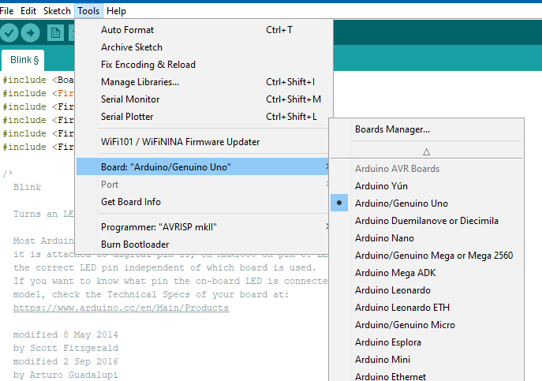
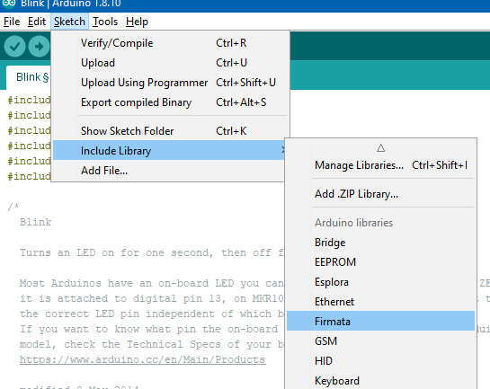
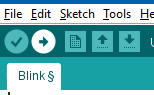
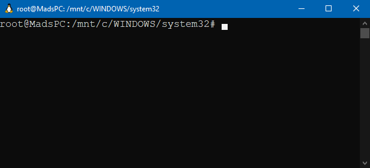
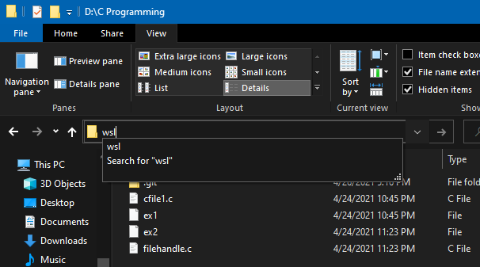
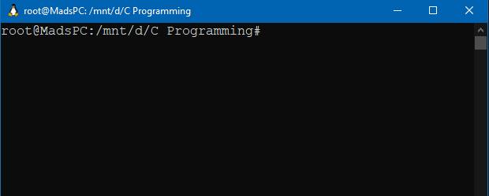

# Course - Lab activity requirements

### <u>Python - Pyfirmata installation</u> {#python}

* Find the latest version [here](https://www.python.org/downloads/)

* Pip comes along with python. In case if you don't have it 

  - go to this [website](https://bootstrap.pypa.io/get-pip.py)

  - save that page as get-pip.py file in your pc and run this code in command prompt at the same directory.

    ```bash
    C:>py get-pip.py
    ```

* You will need pyfirmata to run python program directly into Arduino board

  * Open arduino > connect board to PC > Tools > Board, Port (Select the correct one)
  * In your case it can be Arduino Uno and COM port x (x will be different for each)

  

  * Sketch > Include Library > Firmata (will open Firmata library file)

    

  * Compile and upload that file to your Arduino board

    

### <u>Auto Desk - Auto CAD Download</u> {#autocad}

* Don't download pirated software from getintopc.com or thepiratebay.com like websites
* You have student access to Auto Desk products (in University of Peradeniya)
* Go to [Auto Desk Student Page](https://www.autodesk.com/education/edu-software/overview)
* Get started from there. You have to use your eng.pdn*** email address to verify you as a student
* If it didn't recognize you, you can still upload you student ID picture and get approval in few days.
* Note that this is a **1 year free license**. So you can use it for the first year CAD program.


### <u>Installing WSL in Windows 10</u> {#wsl}

You will find a lot of work to be done in UNIX environment in your programming courses even though you can do that in windows. It's really useful to get used work in terminal as industry expects it.

**[Find why you need the ability to handle computing in the UNIX based terminal.](https://www.edureka.co/blog/top-reasons-to-learn-unix-shell-scripting/)**

This is a basic guide to setup LINUX sub-system in Windows (There are other systems based on UNIX as well). If you search in google you can find many ways to use Linux. 

1. Completely switching to Linux (PC with only Linux) 
   * You will miss the GUI experience as we are about to have Windows 11 with good looking GUI.
2. Dual boot your PC with Windows and Linux
   * Bad idea if you have a smaller RAM. Slows down your PC.
3. Use a virtual machine in Windows and install Linux in it (VM Ware, Virtual box etc.)
   * Similar to dual boot but less impactful and easy to install and remove.
4. **Setting up only the Linux terminal in Windows**
   * **Better compared to the above mentioned methods** :smiley:

#### Steps:

##### Hey I'm Little lazy to type everything here :sweat_smile:

[You can find the detailed steps to install WSL (Windows sub-system for Linux) here.](https://www.windowscentral.com/install-windows-subsystem-linux-windows-10)

WSL installed in your C disk. Therefore, if you open WSL directly and create files, it will be stored in C disk. 



But you can simply open any folder you want to work and open WSL terminal there immediately.






### <u>Setting up compile and run environment for C language</u> {#gcc}

You have to learn C language to understand the fundamentals of how programming and computer architecture connected and work together. Most of the times in university coursed you are supposed to use terminal or command line to run the program. (IDEs are not preferred :disappointed:)

**You need very few steps to setup C environment.**

##### What you need?

1. The **[Linux terminal](#wsl)** (preferred) or command prompt
2. **gcc** - GNU Compiler Collection for C/C++ Languages
3. **gdb** - GNU debugging tool for C/C++ Languages

It is better to use a Linux terminal to get used to the command line experience. So let's install these tools on Linux terminal.

**gcc**

Run these commands in your WSL terminal

```bash
$ sudo apt update
```

```bash
$ sudo apt install build-essential
```

The build essentials will install `gcc`, `g++` and `make` in your machine(WSL).

Check whether gcc is successfully installed, using this command;

```bash
$ gcc --version
```

If you get something similar to this, your installation is successful;

```bash
gcc (Ubuntu 7.5.0-3ubuntu1~18.04) 7.5.0
Copyright (C) 2017 Free Software Foundation, Inc.
This is free software; see the source for copying conditions. There is NO warranty; not even for MERCHANTABILITY or FITNESS FOR A PARTICULAR PURPOSE.
```


**Compile and run .c files**

Compile

```bash
$ gcc -Wall myprogram.c -o myprogram
```

Execute/ Run

```bash
$ ./myprogram
```

[Learn more about intermediate stages (pre-processing, assembling, compiling ...) in .c file to object file here](https://medium.com/@laura.derohan/compiling-c-files-with-gcc-step-by-step-8e78318052)


**gdb**

Run these commands in WSL terminal

```bash
$ sudo apt-get update
```

```bash
$ sudo apt-get install gdb
```

[How to use this debugging tool?](http://www.gdbtutorial.com/tutorial/how-use-gdb)


